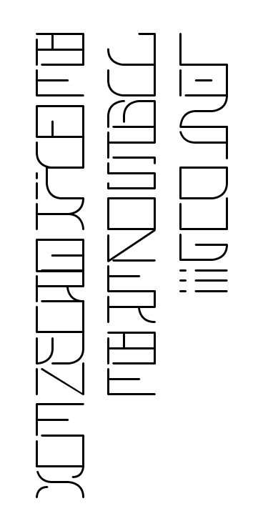
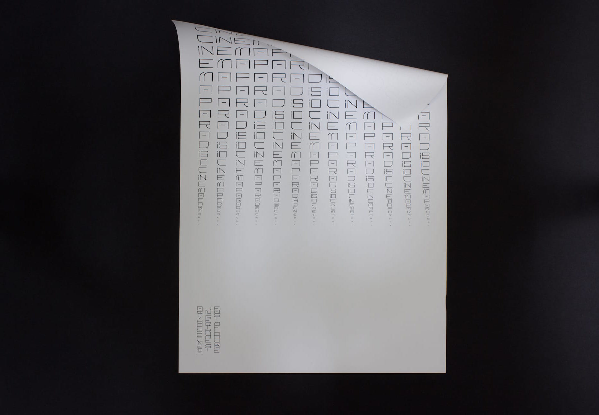
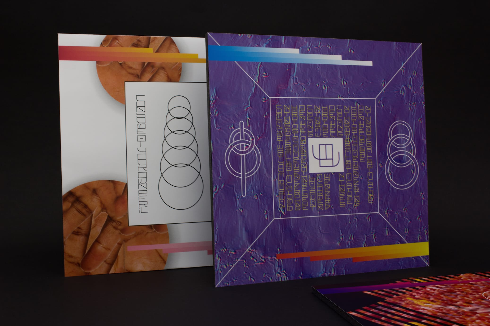
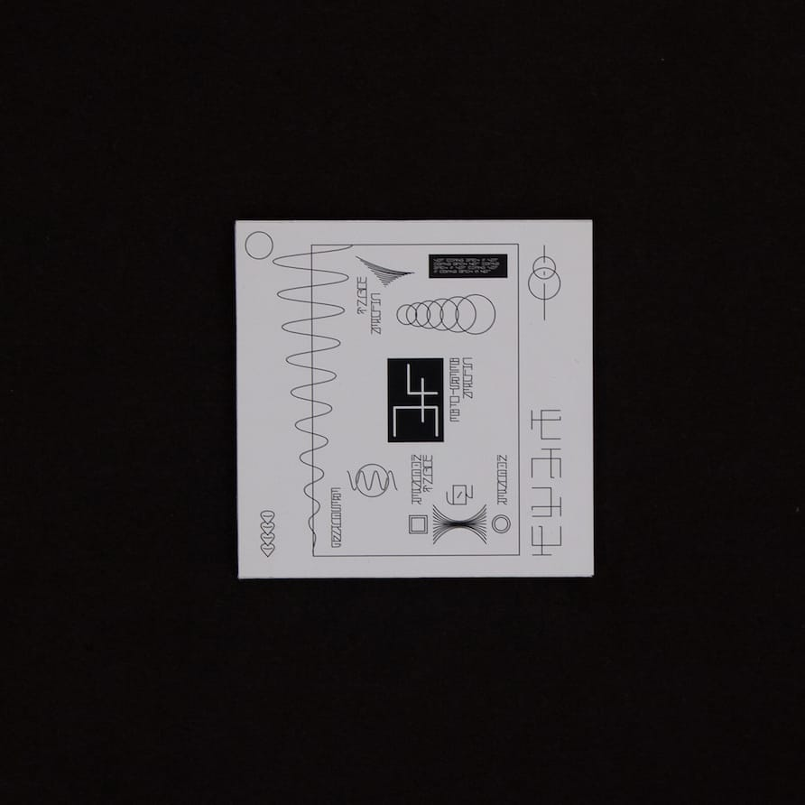

# International Neue English

*The quick brown fox jumps over the lazy dog!!!*

A speculative typeface for Brief my Sabbatical project. Opentype, SVG paths, and FontForge source files available  under a SIL Open Font License (OFL) v1.1

## About
This project is an attempt at imagining how the Latin alphabet could be redesigned to work in a primarily vertical context. It arose from a desire to experiment with a grid-based structure and connecting strokes, while exploring the textural and decorative aspects of letterform.

## Usage in Adobe Illustrator
Illustrator doesn't seem to support ligatures in vertical type, so to work around this limitation type on a path must be used.
1. Draw a straight path as long as you want your column of text to be. Select it with the 'Type on Path' tool.
1. Under the 'Type' menu, select 'Type on Path > Stair Step'. This should ensure the letters sit under each other.
1. Under the 'Character' panel, set 'Tracking' to -400 (This is the size of the gap under the glyphs in ems). This is so that the letters appear attached.
1. Enable ligatures and contextual alternates under the 'Opentype' panel.
3. Begin typing and enjoy!

Lowercase letters have an incision in the top-left corner, Uppercase does not. I usually Capitalise Each Word In A Sentence.

## Examples
The following are some examples in use from the rest of my project.

2017, adrianfranzese (at) gmail.com
